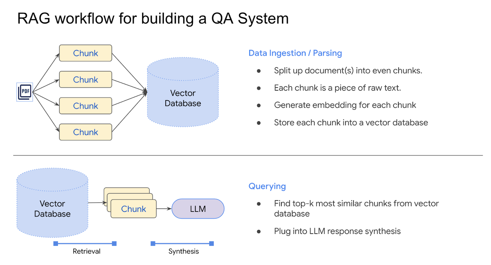

# REXchat Multimodal RAG System



## Overview
This is an advanced, high-performance Retrieval-Augmented Generation (RAG) system built with **Gemini 2.5 Flash**, **Qdrant**, and **models/gemini-embedding-001**. Designed to handle complex multimodal PDF documents, it extracts and comprehends both text and images intelligently, providing precise, heavily-grounded answers to prevent hallucinations.

## Key Features
- **Multimodal Ingestion Pipeline**: Automatically extracts images and tables from PDFs using PyMuPDF and processes them with Gemini Vision to create rich textual descriptions before vectorization.
- **Advanced RAG (Anti-Hallucination & HyDE)**: Features an optional advanced mode using Hypothetical Document Embeddings (HyDE) to significantly boost retrieval accuracy, along with strict system prompts that force citations and explicitly reject ungrounded answers.
- **High-Dimensional Embeddings**: Utilizes the modern `models/gemini-embedding-001` (3072 dimensions) for granular semantic search via Qdrant's vector capabilities.
- **Modular Frontend**: Built with Streamlit, separating concerns across Configuration, Knowledge Base, and Chat pages for a clean UI.

## How to Run
1. **Install Dependencies**:
   ```bash
   pip install -r requirements.txt
   ```
2. **Start the Application**:
   ```bash
   streamlit run main.py
   ```

## Usage Guide
1. **Configuration Page**:
   - Enter your **Gemini API Key** and **Qdrant URL/API Key**.
   - Note: The app initializes session state variables to securely persist these credentials seamlessly across pages.
2. **Knowledge Base Page**:
   - Upload a PDF document.
   - Toggle **Multimodal Processing** (Extract & Describe Images).
   - Click **Process and Index**.
   - Monitor the progress bar as images are analyzed via Gemini Vision and stored.
3. **AI Chatbot Page**:
   - Enable **Advanced RAG** in the sidebar.
   - Ask questions about your document.
   - Expand the **Sources & context** section to verify exact chunk citations and sources.
